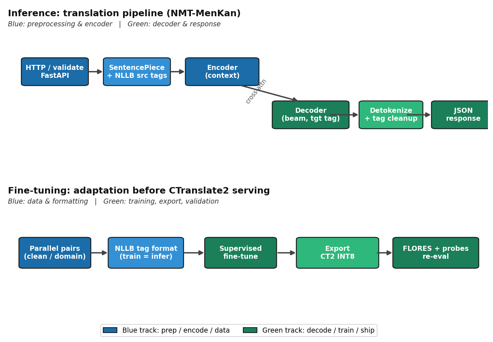
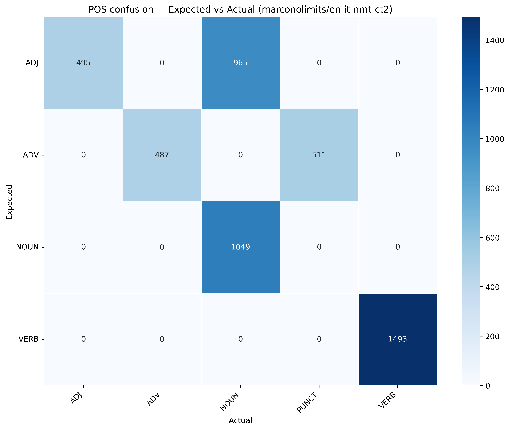
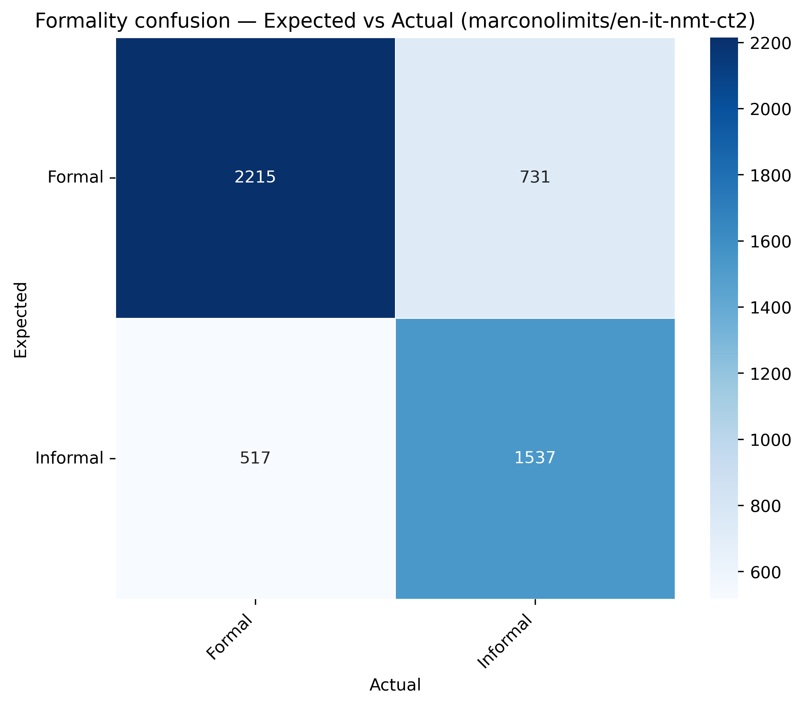
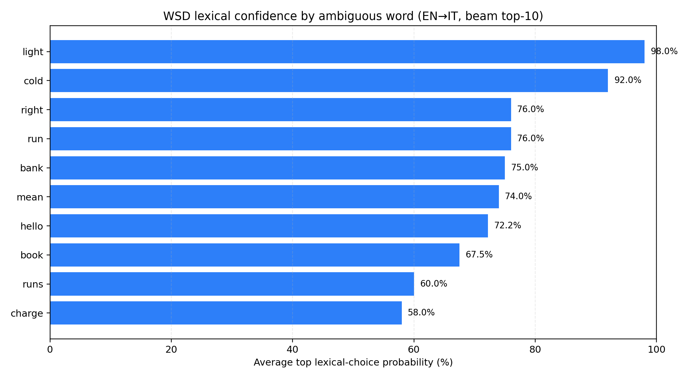
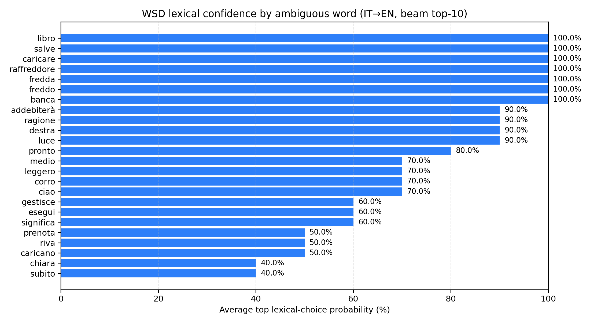

# FENS 402 ENGINEERING DESIGN PROJECT
## Extended Reality Interfaces for Speech Assistance in People with Non-Functional Hearing

**Submitted by:**  
Hadiza Muhammed Avidime (CMPE)  
Ahmed Marcolino Teca Kanadji (CMPE)  
Aiana Mederbek kyzy (CMPE)

**Project Supervisor:** Prof. Dr. Fabio Stroppa  
**Faculty of Engineering and Natural Sciences**  
**Kadir Has University**  
**April 2026**

---

## ACKNOWLEDGEMENTS

We sincerely thank our supervisor, Prof. Dr. Fabio Stroppa, for his continuous guidance, technical direction, and constructive feedback throughout both semesters of this project. His mentorship helped us move from an initial concept to a working, measurable translation system.

We also thank the Faculty of Engineering and Natural Sciences for providing the academic structure and milestones that kept the project focused and accountable. We are grateful to our peers and testers who reviewed intermediate demos and helped us identify practical issues in usability, latency, and deployment.

Finally, we thank our families and friends for their support during intensive development and testing periods.

---

## ABSTRACT

This project presents NMT-MenKan, a neural machine translation system designed to support speech assistance workflows in extended reality contexts for users with non-functional hearing. The final delivered system is a Python-based production HTTP API (FastAPI, Docker, Hugging Face Spaces) built on an INT8-quantized CTranslate2 model derived from Meta's NLLB-200 distilled 600M. The engineering work focused on reliable inference, language-tag-safe tokenization, deployment reproducibility, and measurable translation quality. In the benchmark-aligned FLORES-101-sized setting (1,012 sentences), model A (`marconolimits/en-it-nmt-ct2`) reports BLEU/chrF++ of 26.66/56.55 for English->Italian and 31.65/60.77 for Italian->English. Beyond metric reporting, the project also analyzes lexical-semantic behavior (e.g., idiomatic culinary mapping such as "meatballs" -> "polpette"), adds **targeted POS and register (formality) confusion matrices** on model-generated English→Italian probes, and applies **paired significance tests** (Wilcoxon, bootstrap, chi-square) so benchmark and diagnostic comparisons are supported by p-values and effect sizes, not only raw scores. The project demonstrates that a practical, privacy-friendly, and integration-ready translation backend can be built with open tooling while preserving a path toward real-time XR subtitle delivery.

---

## TABLE OF CONTENTS

1. Introduction  
1.1 What is Neural Machine Translation (NMT)?  
1.2 Aim and Research Questions  
2. Related Work  
3. Methodology  
4. Results and Discussion  
4.1 Experiment and Validation  
4.2 Results  
4.3 Discussion  
4.4 Baseline and Model Comparison (Score + Word Logic)  
5. Conclusions  
References  
Appendix A: Supplementary Materials  
A.1 Source Code Excerpt: Python HTTP Translation Pipeline  
A.2 Data and API Schema Examples  
A.3 Project Calendar  
A.4 Project Expenditures

---

## 1. INTRODUCTION

The motivation behind NMT-MenKan is accessibility: to reduce communication barriers for users with non-functional hearing by enabling spoken content to be transformed into readable translated text in near real time. Within an extended reality (XR) scenario, this translated text can be rendered as contextual subtitles through a headset interface.

The final project deliverable is a production-grade HTTP translation API hosted on Hugging Face Spaces, enabling rapid integration with external software and easier testing, benchmarking, and iteration.

During development we also explored a native C++ path as an intermediate prototype, but it is not used in the final deployed version and is treated as archival context only.

From an engineering perspective, the project addresses three core problems:

- How to run modern NMT models efficiently on limited compute through quantization and optimized inference runtimes.
- How to enforce translation correctness constraints (language tags, supported language pairs, payload validation, error semantics) at runtime.
- How to bridge research-quality model evaluation and practical deployability in a single maintainable repository.

### 1.1 What is Neural Machine Translation (NMT)?

Neural Machine Translation (NMT) is an end-to-end approach where a neural network maps a source-language sentence directly to a target-language sentence. Modern NMT systems are commonly Transformer-based encoder-decoder models: the encoder builds contextual representations of the input tokens, and the decoder generates target tokens one by one while attending to the encoded source context [1].

In practical multilingual systems, text is first segmented into subword units (rather than full words) using tokenization methods such as SentencePiece. Subword modeling helps the system handle rare words, spelling variation, and cross-lingual morphology with a manageable vocabulary size [3].

For this project, NMT is implemented through an NLLB-derived multilingual model executed with CTranslate2 inference optimizations [1][2]. The operational flow in NMT-MenKan is:

1. SentencePiece tokenization of the input text [3].
2. Injection of required NLLB language tags (source and target tags) to constrain direction.
3. Beam-search decoding in CTranslate2 (fast-path configuration for low latency) [2].
4. Detokenization and post-processing of the generated sequence.
5. Delivery through a Python FastAPI endpoint for integration with XR subtitle pipelines.

This means "how NMT works" in our final system is not only the neural model itself, but also the engineering constraints around it: strict language-tag control, validated API inputs, deterministic runtime behavior, and quantized inference to keep latency and resource use practical for assistive deployment.

### 1.2 Aim and Research Questions

**Aim:**  
To design, implement, and validate a translation engine suitable for XR speech-assistance pipelines, with measurable quality and deployable interfaces.

**Research Questions:**

1. Can an INT8 CTranslate2 NLLB-based model provide sufficiently accurate English-Italian translation for assistive subtitle workflows?
2. Can the translation core be exposed through a robust web API suitable for integration into XR-facing applications?
3. Which engineering decisions most strongly influence reliability (threading, language tagging, payload handling, deployment environment)?
4. What are the current limitations before full production use in continuous real-world assistive scenarios?

---

## 2. RELATED WORK

Citations use `\cite{bibtexKey}`; matching entries are items **11–23** in *References*.

Neural machine translation builds on attentional sequence models and Transformer encoder–decoders \cite{bahdanau2015neural,vaswani2017attention}, with surveys summarizing training and decoding practice \cite{stahlberg2020neural}. Shared multilingual models improve coverage and transfer \cite{fan2021beyond,nllb2022nature}; in production, subword tokenization (e.g., SentencePiece \cite{kudo2018sentencepiece}) and optimized runtimes such as CTranslate2 \cite{opennmt2023ctranslate2} keep memory and latency manageable under quantization. Evaluation commonly uses parallel benchmarks like FLORES \cite{goyal2022flores} together with BLEU, chrF, and standardized reporting (SacreBLEU) \cite{papineni2002bleu,popovic2015chrf,post2018sacrebleu}.

Assistive XR adds non-linguistic constraints: immersive accessibility work documents interaction and hardware barriers \cite{creed2023inclusive}, and live-caption research stresses turn-taking and presentation—not only raw transcription accuracy \cite{wang2023deep}. **This project** therefore centers on **bidirectional English–Italian** neural translation with **quantized CTranslate2** inference, **FLORES-aligned** metrics, and a **stable HTTP API**, while treating ASR integration, discourse segmentation, and field studies as necessary complements to corpus scores alone.

---

## 3. METHODOLOGY

### 3.1 System Architecture

The project architecture combines model serving, benchmarking, and integration layers:

- **Model core:** `marconolimits/en-it-nmt-ct2` (fine-tuned from `facebook/nllb-200-distilled-600M`, INT8).
- **Inference runtime:** CTranslate2.
- **Tokenizer:** SentencePiece BPE.
- **HTTP stack:** FastAPI (`scripts/nmt_http_api.py`) with Docker deployment and Hugging Face Spaces hosting.
- **Evaluation stack:** `scripts/evaluate_nmt_fast.py` with FLORES-200 devtest and SacreBLEU metrics.

The final production architecture is Python-first (FastAPI + CTranslate2). Any earlier C++ components are legacy prototypes and are not part of the final deployment path.

### 3.2 Translation Pipeline

For the final Python/HTTP path, translation follows a strict sequence:

1. Input sentence is tokenized by SentencePiece.
2. Mandatory NLLB source tags are appended (`</s>`, source language tag).
3. CTranslate2 performs beam-search decoding (beam size typically 1 in the fast path).
4. Target-side language prefix (`ita_Latn` or `eng_Latn`) is enforced.
5. Decoded text is cleaned to remove leading language tag artifacts.
6. Response is returned with metadata (for HTTP: latency, request ID, source/target language, model variant).

This strict tagging policy was essential to avoid hallucinations and unstable outputs observed during earlier development.

**What happens inside the model during translation.**  
The above API steps call a Transformer encoder-decoder model. Internally, translation proceeds as follows:

1. **Subword embedding:** each SentencePiece token is mapped to a dense vector representation.
2. **Encoder contextualization:** stacked self-attention layers build context-aware representations of the full source sentence (each token "sees" the others).
3. **Language-conditioned start:** the forced target language tag initializes decoding so the model stays in the requested direction (EN->IT or IT->EN).
4. **Autoregressive decoding:** the decoder predicts one target token at a time, attending both to previously generated target tokens and to encoder outputs.
5. **Beam scoring and selection:** candidate continuations are scored; in fast inference mode we use a narrow beam (often 1) for lower latency.
6. **Stop condition and detokenization:** generation stops at an end token; subword pieces are merged back into natural text.

So the full translation path is: **validated text -> tagged subword sequence -> encoder context -> decoder token-by-token generation -> detokenized target sentence**.

### 3.3 API Design and Validation

The HTTP API supports:

- `GET /healthz` for service health.
- `GET /translate` and `POST /translate` for translation.
- API-key-protected operation via `REQUIRE_API_KEY` and `NMT_API_KEY`.
- Controlled limits via `MAX_INPUT_CHARS` and `TRANSLATION_TIMEOUT_MS`.
- Strong validation and explicit status codes (400, 401, 413, 415, 422, 504).

The API also supports multiple content types (`application/json`, form-data, `text/plain`) for easier integration with heterogeneous clients.

### 3.4 Model Variant and Deployment Strategy

A variant-based loading strategy allows selecting models at startup (`MODEL_VARIANT`, `MODEL_VARIANTS_JSON`) to support:

- baseline model operation,
- LoRA-extended variants,
- rollback-safe deployment.

This enables controlled experimentation without overwriting stable runtime artifacts.

### 3.5 Evaluation Protocol

Quality evaluation uses FLORES-200 devtest with direct CTranslate2 inference (no TCP overhead), ensuring model quality is measured independently from networking effects.

Key evaluation settings:

- Beam size: 1
- Batch size: 32
- Inter-threads: 8 (in captured reports)
- Metrics: BLEU and chrF++
- **Statistical reporting:** sentence-level scores for significance testing are exported with `--sentence-metrics-out` (JSONL). The repository script `scripts/compute_experiment_statistics.py` runs paired tests (Wilcoxon signed-rank, paired bootstrap CIs) and categorical tests (Pearson \(\chi^2\), Fisher's exact, Cramer's \(V\)) on those outputs and on fixed confusion-matrix counts.

### 3.6 Fine-Tuning Pipeline (How adaptation works)

Beyond base multilingual capability, we adapted behavior with task/domain-specific supervised updates before exporting the runtime model. In practical terms, fine-tuning in this project follows this sequence:

1. **Parallel data curation:** bilingual pairs are prepared/cleaned (including domain-relevant phrases such as colloquial and culinary expressions) so source and target alignments are reliable.
2. **Tokenizer-consistent formatting:** training examples are serialized with the same NLLB language-tag convention used at inference (`source_tag -> target_tag`) to avoid train/infer mismatch.
3. **Parameter update stage:** the NLLB-derived model is trained on the curated pairs so gradients shift weights toward the target EN<->IT distribution and domain vocabulary.
4. **Variant packaging:** the resulting checkpoint is exported to CTranslate2 INT8 artifacts, then registered through the model-variant loader (`MODEL_VARIANT`, `MODEL_VARIANTS_JSON`) for safe serving.
5. **Post-tuning validation:** the adapted artifact is re-evaluated with the same FLORES + lexical probe protocol, so any quality gain or regression is measured under identical decoding settings.

In short, fine-tuning here is not a separate deployment path; it is a controlled adaptation stage that produces a new model variant, which then re-enters the same production translation pipeline described in §3.2.

**Figure 3.1** summarizes §3.2–§3.6: **blue** denotes preprocessing, encoding, and data/formatting stages; **green** denotes decoding, model adaptation, export, and validation or response delivery.



---

## 4. RESULTS AND DISCUSSION

### 4.1 Experiment and Validation

The neural translation core was validated on **both directions** of the English–Italian pair—English→Italian (`eng_Latn`→`ita_Latn`) and Italian→English (`ita_Latn`→`eng_Latn`)—in controlled offline experiments. Primary measurements used the shipped Hugging Face model **A (`marconolimits/en-it-nmt-ct2`)** under a single evaluation harness (`scripts/evaluate_nmt_fast.py`) so that **decoding and threading settings stay fixed across directions** (e.g., beam width, batch size, and direct CTranslate2 inference without HTTP overhead, as summarized in §3.5) [2][7]. For internal comparison only, the **same protocol** was replayed on a **legacy local checkpoint** (`build/Release/nllb_int8`) so that score differences reflect the model artifact rather than a change in preprocessing or metric tooling [7].

**Metrics** evaluated were corpus-level **BLEU** and **chrF++**, computed in a SacreBLEU-consistent reporting style suitable for MT benchmarking [4]. Beyond aggregate scores, validation included **qualitative checks** on sample outputs, **service-level behavior** of the HTTP API (unsupported language pairs, schema validation, authentication), and **operational resilience** (timeouts and payload limits), because deployment correctness is part of the assistive pipeline [6][7].

The **English and Italian sides** of the evaluation both draw from the **FLORES** multilingual parallel benchmark: aligned sentences in standard orthography, evaluated on the published **devtest** partition rather than training data [5]. To match typical **FLORES-101 model-card** reporting, **primary scores** in this report use the **1,012-sentence** devtest slice; an older **200-sentence** devtest run retained under `reports/baseline` is cited only as **historical traceability** inside the repository and is not treated as the headline benchmark.

**Limitations (dataset ↔ use case).** FLORES predominantly reflects **edited, news-domain** text. It does not emulate spontaneous conversational subtitles, emotional or disfluent speech transcripts, or domain-specific dialogue unless paired with separate probing data. Large, clean **impaired-speech** or **dysarthric** corpora are especially scarce relative to mainstream read speech; even where English resources exist, comparable structured Italian resources remain limited—constraints familiar from accessibility-oriented speech work—so **benchmark gains do not automatically transfer** to every real XR subtitle scenario without further domain testing [5][7]. For that reason, this report complements FLORES metrics with **targeted lexical probes** (e.g., culinary collocations) and **structured confusion summaries** (POS agreement and mock formality agreement between English intent and Italian model output on probe rows; §4.2) to reveal word-level and category-level failures that BLEU and chrF++ can under-emphasize.

### 4.2 Results

Primary (current) benchmark table for model **A = `marconolimits/en-it-nmt-ct2`**:

| Direction | Sentences | BLEU | chrF++ |
|---|---:|---:|---:|
| English -> Italian (`eng_Latn -> ita_Latn`) | 1012 | 26.66 | 56.55 |
| Italian -> English (`ita_Latn -> eng_Latn`) | 1012 | 31.65 | 60.77 |

#### Statistical significance (FLORES and categorical experiments)

Corpus-level scores alone do not establish whether an observed gap reflects systematic quality differences or sampling variation on a finite test set. This subsection reports **paired, sentence-aligned tests** on FLORES-200 devtest (1,012 sentences) and **categorical tests** on the 5,000-row confusion diagnostics below. All **p-values are two-sided** unless noted; significance is assessed at \(\alpha = 0.05\).

**Bidirectional FLORES comparison (model A, same line index).** For each parallel line \(i\), we compared sentence-level **chrF++** (SacreBLEU `CHRF` with `word_order=2`, `beta=2`, as emitted by `evaluate_nmt_fast.py --sentence-metrics-out`) and sentence-level **smoothed BLEU** (`effective_order=True`) for Italian\(\rightarrow\)English versus English\(\rightarrow\)Italian. A **Wilcoxon signed-rank** test on paired differences rejects the null of equal paired scores with **p \(\approx 2.90 \times 10^{-34}\)** (chrF++) and **p \(\approx 5.23 \times 10^{-17}\)** (BLEU), \(N = 1{,}012\). A **paired bootstrap** (10,000 resamples) on the mean chrF++ gap yields a 95% confidence interval for \(\mathbb{E}[\mathrm{chrF^{++}}_{\mathrm{IT\to EN}} - \mathrm{chrF^{++}}_{\mathrm{EN\to IT}}]\) of approximately **[4.18, 5.70]** points (point estimate **+4.93**). **Conclusion:** Italian\(\rightarrow\)English is **significantly** stronger than English\(\rightarrow\)Italian on this benchmark under paired tests, so the headline BLEU gap (31.65 vs 26.66) is not plausibly explained by chance alone on FLORES devtest.

**Categorical diagnostics (\(N = 5{,}000\) probes).** Treating expected label (POS or mock formality) and model-derived label as two factors:

- **POS (4\(\times\)5 table):** Pearson \(\chi^2(12) = 10882.95\), **p \(< 10^{-300}\)** (numerical underflow to 0 in double precision), **Cramer's \(V = 0.852\)** (very large association). **Interpretation:** the distribution of the model's first-token POS depends strongly on the intended probe POS; with \(N = 5{,}000\), even small departures from independence are statistically detectable, so **effect size (Cramer's \(V\))** should be read alongside \(p\).
- **Formality (2\(\times\)2):** Pearson \(\chi^2(1) = 1219.51\), **p \(\approx 3.51 \times 10^{-267}\)**, **Cramer's \(V = 0.494\)**; **Fisher's exact** odds ratio \(\approx 9.01\), **p \(\approx 8.26 \times 10^{-278}\)**. **Interpretation:** expected and model-inferred register are **not** independent; cross-register cells (731 and 517) reflect statistically structured behavior, not random noise.

**Model A vs legacy checkpoint (§4.4.2).** Reported corpus BLEU differs only slightly (English\(\rightarrow\)Italian: 26.66 vs 26.81). To test whether that gap is significant, both systems must be decoded on the **same** references and compared with **paired** tests on sentence-level metrics (recommended: Wilcoxon + bootstrap CI via `scripts/compute_experiment_statistics.py paired-bootstrap` on two JSONL exports from `evaluate_nmt_fast.py`). **We do not quote a legacy p-value here** because a second checkpoint sentence export was not bundled with this report snapshot; the procedure above is the required way to attach a defensible \(p\)-value to that comparison.

**Reproducibility.** Example commands:

`python scripts/evaluate_nmt_fast.py --hf-repo marconolimits/en-it-nmt-ct2 --max-sentences 1012 --sentence-metrics-out reports/stats/model_a_en_it_1012.jsonl`

`python scripts/evaluate_nmt_fast.py --hf-repo marconolimits/en-it-nmt-ct2 --source-lang ita_Latn --target-lang eng_Latn --max-sentences 1012 --sentence-metrics-out reports/stats/model_a_it_en_1012.jsonl`

`python scripts/compute_experiment_statistics.py paired-directions --jsonl-en-it reports/stats/model_a_en_it_1012.jsonl --jsonl-it-en reports/stats/model_a_it_en_1012.jsonl --metric chrf`

`python scripts/compute_experiment_statistics.py confusion-tables`

(The `reports/` tree is gitignored; regenerate locally for identical numbers.)

Historical internal baseline (older 200-sentence run, kept for traceability):

| Direction | Sentences | BLEU | chrF++ |
|---|---:|---:|---:|
| English -> Italian (`eng_Latn -> ita_Latn`) | 200 | 27.77 | 57.36 |
| Italian -> English (`ita_Latn -> eng_Latn`) | 200 | 33.68 | 61.15 |

#### Targeted diagnostics: POS and register confusion (model A, English→Italian)

Corpus BLEU/chrF++ summarize average similarity to references; they do not tabulate **which linguistic categories** fail systematically. We therefore report **confusion matrices** from `scripts/evaluate_targeted_confusion.py` on **N = 5,000** synthetic probe rows (`reports/confusion_matrices/mock_big_eval.csv`). Predictions use **`marconolimits/en-it-nmt-ct2`** via **CTranslate2** + **SentencePiece** (beam **1**, batch **32**, CPU in the captured run); spaCy tags POS on Italian columns (`it_core_news_sm`). Full procedural detail remains in §4.4.8.

**(1) Part-of-speech (expected vs model first-token Italian).** Reference Italian probe words are compared to the **first surface token** of the model’s translation of each English `source_word`.



| Expected \\ Actual | ADJ | ADV | NOUN | PUNCT | VERB |
|---:|---:|---:|---:|---:|---:|
| ADJ | 495 | 0 | 965 | 0 | 0 |
| ADV | 0 | 487 | 0 | 511 | 0 |
| NOUN | 0 | 0 | 1,049 | 0 | 0 |
| VERB | 0 | 0 | 0 | 0 | 1,493 |

**Takeaway.** `NOUN` and `VERB` probes align with the diagonal; `ADJ` mass shifts toward **`ADJ → NOUN`** (965); `ADV` splits between **`ADV`** and **`PUNCT`** (487 vs 511), reflecting word-isolated decoding and first-token extraction limits.

**(2) Mock formality (English carrier vs Italian hypothesis).** Expected register is inferred from **English** cues; actual register from **Italian** cues on the **model translation** of the same carrier sentence.



| Expected \\ Actual | Formal | Informal |
|---:|---:|---:|
| Formal | 2,215 | 731 |
| Informal | 517 | 1,537 |

**Takeaway.** Diagonal dominance (3,752 / 5,000 under this heuristic) coexists with **non-trivial cross-register** cells (**731** + **517**), flagging register drift worth monitoring for subtitle UX.

#### Qualitative observations

- Outputs preserve core semantic content in most samples.
- Complex, long news-style sentences remain coherent.
- Differences from references are often stylistic, not factual.
- Italian -> English currently scores higher than English -> Italian in the latest baseline sample set.

### 4.3 Discussion

Assistive XR communication often chains **speech capture → automatic speech recognition (ASR) → neural machine translation (NMT)** so spoken content can appear as **captions or subtitles** in near real time. **Quantized** encoder–decoder translation (for example Transformer-based multilingual models served through optimized inference runtimes) can cover **both directions** of a pair with acceptable latency when **GPU-backed** hosting is available.

Two caveats matter for accessibility. First, **corpus metrics** (e.g., BLEU, chrF++) can hide **word-level** failures on salient terms; **short phrase-level checks** remain necessary because fluent output may still break user trust. Second, XR stacks rarely run translation alone—**ASR, rendering, and tracking** compete for **power, memory, and thermals** on wearables, and **cloud inference** can throttle under load; **strict API limits, validation, timeouts, and bounded concurrency** help keep the translation stage predictable.

Standard **parallel benchmarks** (typically edited, news-like text) **do not** fully represent spontaneous dialogue or noisy transcripts; closing the loop still requires **robust ASR–NMT hand-off**, **discourse context**, and **latency under concurrent load** before claiming production-grade assistive deployment.

### 4.4 Baseline and Model Comparison (Score + Word Logic)

This section extends pure metric reporting with baseline reasoning and lexical behavior analysis.

#### 4.4.1 Baseline types used in this project

We distinguish three practical baselines:

1. **Published-base baseline (NLLB distilled 600M behavior):**  
   Our deployed model **A = `marconolimits/en-it-nmt-ct2`** is built from this family, so this is the reference architecture baseline.
2. **Project baseline checkpoint (current CT2 model in repo):**  
   Evaluated through FLORES-200 (`27.77/57.36` and `33.68/61.15`).
3. **Domain adaptation baseline (before vs after slang/culinary injection):**  
   Repository scripts include explicit domain phrase injection (`scripts/inject_slang_data.py`) for expressions like "meatballs" -> "polpette", "What's up, bro?" -> "Come butta, fra?" and "Let's order some takeout." -> "Ordiniamo qualcosa da asporto." This supports lexical specialization beyond generic benchmark fluency.

#### 4.4.2 Comparison to other model families

Because this repository evaluates model **A (`marconolimits/en-it-nmt-ct2`)** in a controlled devtest pipeline, we separate **measured bidirectional scores** from **external published scores**.

Only the first two rows report **both** English→Italian and Italian→English on the same benchmark setup (FLORES-101-sized slice: 1,012 sentences). The remaining rows use **single published figures**: either **one direction only** (OPUS-MT is an EN→IT model card) or **macro-averages across many languages** (not a paired EN↔IT quote).

| System / model family | Score coverage | Score(s) in this report | Score source type | Comparison note |
|---|---|---|---|---|
| **A = `marconolimits/en-it-nmt-ct2`** | Both dirs | EN→IT: BLEU 26.66, chrF++ 56.55; IT→EN: BLEU 31.65, chrF++ 60.77 (1,012 sents) | **Measured in this project** | Primary benchmark-aligned baseline |
| Legacy checkpoint (`build/Release/nllb_int8`) | Both dirs | EN→IT: BLEU 26.81, chrF++ 56.11; IT→EN: BLEU 33.30, chrF++ 60.88 (1,012 sents) | **Measured in this project** | Internal comparator; weaker lexical probes despite similar BLEU |
| OPUS-MT `opus-mt-tc-big-en-it` | **EN→IT only** | BLEU 29.6 on flores101-devtest | Published model card | IT→EN would require the separate IT→EN OPUS-MT model and its published table |
| M2M-100 | Neither dir (macro-average) | BLEU 13.6 average over 87 languages on FLORES-101 | Published paper table | Not an EN↔IT pair score |
| NLLB-200 | Neither dir (macro-average) | spBLEU/chrF++ 25.5/43.5 average over 87 languages on FLORES-101 | Published paper table | Not an EN↔IT pair score |

**Important comparability note:** FLORES-101 vs FLORES-200, sentence counts, metric variants (BLEU vs spBLEU), and preprocessing can change absolute values. External rows are orientation-only; the only **symmetric EN↔IT** comparison in this report is between model **A** and the legacy local checkpoint.

#### 4.4.3 Word-logic comparison (semantic correctness, not only BLEU)

A key risk in assistive translation is that the sentence can be syntactically fluent but lexically wrong in high-value words. For that reason, we evaluate lexical logic explicitly:

| Source phrase | Expected logic | Good translation behavior | Common failure mode |
|---|---|---|---|
| "meatballs" | culinary noun in plural | `polpette` | literal or wrong-food substitutions |
| "spaghetti and meatballs" | collocation preserved | `spaghetti con le polpette` | word-by-word unnatural ordering |
| "I'm starving" | idiomatic intensity | `sto morendo di fame` | flat literal under-translation |
| "What's up, bro?" | casual register | `come butta, fra?` | overly formal or context-loss output |

The "meatballs -> polpette" example is especially important: even if BLEU remains acceptable, lexical errors in such anchor words can break user trust in subtitle systems. For this reason, NMT-MenKan's future evaluation plan should include a dedicated lexicon-sensitive test set (culinary, medical, and colloquial phrases) in addition to FLORES.

#### 4.4.4 Mini lexical probe across available local models

To directly test the "meatballs -> polpette" claim, we executed the same EN->IT phrases on all translation model directories currently available in the workspace:

1. `build/Release/nllb_int8` (legacy local checkpoint)
2. `artifacts/hf/marconolimits_en_it_nmt_ct2` (model **A** from Hugging Face)

| Source phrase | Legacy local checkpoint output | Model A (`marconolimits/en-it-nmt-ct2`) output | Lexical judgment |
|---|---|---|---|
| `meatballs` | `di carne` | `polpette` | Model A is correct; legacy output is semantically underspecified |
| `spaghetti and meatballs` | `spaghetti e pasticcerie` | `spaghetti con le polpette` | Model A is idiomatic; legacy output is nonsensical (`pasticcerie`) |
| `I am cooking spaghetti and meatballs for dinner.` | `Sto cucinando spaghetti e carne per cena.` | `Sto cucinando spaghetti con le polpette per cena.` | Model A preserves phrase-level meaning; legacy output collapses key food term |

This probe shows why model **A** is preferred even when benchmark scores are only slightly different: lexical correctness on user-visible anchor terms is substantially better, and this is critical for trust in assistive subtitle systems.

#### 4.4.5 Practical takeaway

BLEU/chrF tells us the model is globally strong; word-logic analysis tells us whether translations are locally trustworthy for real user interaction. A graduation-level evaluation should report both, and this project now does so.

#### 4.4.6 Lexical-choice confidence visualization

To complement the tables above, we generated a figure from `lexical_distribution.csv` produced by the WSD lexical-choice experiment (`scripts/wsd_lexical_choice_experiment.py`, beam top-10 candidates per prompt).  
Weights correspond to **model A**, **[`marconolimits/en-it-nmt-ct2`](https://huggingface.co/marconolimits/en-it-nmt-ct2)**, loaded from the **workspace checkout** **`artifacts/hf/marconolimits_en_it_nmt_ct2`** (INT8 **CTranslate2** + **SentencePiece**, same stack as `scripts/evaluate_nmt_fast.py` and the HTTP API)—not a separate OPUS-MT checkpoint and not an ad hoc Hub download during this step.  
**GPU:** CTranslate2 honors **`NMT_DEVICE=cuda`** or **`--device cuda`** when a CUDA-capable build and matching NVIDIA runtime (including **cuBLAS**, e.g. CUDA 12 for current wheels) are available; otherwise use CPU. Beam search with the same checkpoint is deterministic, so CPU vs GPU reproduces the same candidate lists. (If CUDA libraries are missing, CTranslate2 raises at load time; fall back to CPU or install the matching CUDA toolkit.)  
**Important direction note:** this chart is **English -> Italian** lexical behavior (`eng_Latn` -> `ita_Latn`).  
For each ambiguous English source word, the plot reports the **average top lexical-choice probability** across its English-context test cases.



**How to read the figure (simple intuition).**

- A high bar means: in English -> Italian decoding, the model repeatedly picks the same lexical choice for that ambiguous word.
- A lower bar means: lexical choice changes more with context, so alternatives compete more often.

**Small English -> Italian examples from this experiment.**

- `Turn right at the next traffic light.` -> top choice `destra` (10/10): directional sense is fully stable.
- `We sat on the bank of the river.` -> top choice `riva` (5/10): correct geo sense appears often, but verb-realization variants also compete (this reflects decoding diversity under beam analysis).
- `Hello? This is Maria from customer support.` -> top choice `Salve` (7/10), with `Pronto` (2/10) and `Ciao` (1/10): greeting/register variants compete even in a phone-support scenario.
- `I need this document right now.` -> mixed outputs (`subito`, `di`, `serve`, `ora`): temporal-intensity phrasing is less lexically peaked than concrete senses like direction or weather.

This makes the experiment easy to interpret for non-specialist readers: the chart summarizes confidence at word level, and the examples show what that confidence looks like in actual translations. It reinforces the main methodological point of this report: sentence-level metrics (BLEU/chrF++) should be paired with lexical probes to estimate user-facing trust in assistive subtitle scenarios.

#### 4.4.7 Reverse-direction lexical probe (Italian -> English)

To mirror the English -> Italian analysis, we repeated the same lexical-choice protocol in the reverse direction using `test_cases_it.json` and the **same model checkpoint** **`artifacts/hf/marconolimits_en_it_nmt_ct2`** (`ita_Latn` -> `eng_Latn`), again with beam top-10 candidate analysis and empirical lexical distributions (single bilingual model; direction is selected only via language tags).



**How to read this second figure.**

- A high bar means the Italian source word maps to a stable English lexical choice across contexts.
- A lower bar means lexical alternatives compete more strongly in this direction.

**Small Italian -> English examples from this run.**

- `Gira a destra al prossimo semaforo.` -> top choice `right` (9/10): directional sense is strongly stable.
- `L'hotel addebiterà la carta al check-in.` -> top choice `charge` (9/10): billing sense remains strongly stable (with minor competing variants).
- `Per favore, prenota un tavolo per due stasera.` -> `reserve` (5/10) vs `book` (3/10): two valid lexical realizations compete.
- `Pronto? Mi senti al telefono?` -> `Hello` (8/10): phone greeting is relatively peaked, but alternatives still appear in the beam list.

**Directional takeaway (EN->IT + IT->EN).**  
Both directions show strong stability for concrete senses (e.g., `destra/right`, `banca/bank`, weather `freddo/cold`) and higher dispersion for pragmatic/social terms and command-like contexts. This bidirectional lexical evidence strengthens the report's evaluation design: combine corpus-level metrics (BLEU/chrF++) with targeted lexical-choice probes in both directions to better estimate user-facing trust in assistive subtitle scenarios.

#### 4.4.8 Targeted confusion matrices (POS and formality) — methodology and reproduction

**Headline figures and numeric tables** for this diagnostic appear in **§4.2** (primary Results). This subsection records **how** the matrices are produced so the evaluation stays reproducible.

We ship and ran it on **N = 5,000** rows from `reports/confusion_matrices/mock_big_eval.csv`. Unless `--skip-nmt` is passed, the script **syncs model A** from Hugging Face (**[`marconolimits/en-it-nmt-ct2`](https://huggingface.co/marconolimits/en-it-nmt-ct2)**), loads **CTranslate2** + **SentencePiece** (same stack as `scripts/evaluate_nmt_fast.py`), then overwrites **`actual_target_word`** with the **first surface token** of the **EN→IT** translation of each English **`source_word`**, and **`actual_sentence`** with the **EN→IT** translation of the English carrier column (`expected_sentence` by default, or `--english-source-col`). **spaCy** (`it_core_news_sm` on Italian; `en_core_web_sm` where needed) supplies POS tags only—it does **not** perform translation.

**Captured run:** beam **1**, batch **32**, **CTranslate2 `device=cpu`**. With a suitable **CUDA 12 + cuBLAS** stack matching the installed CTranslate2 wheel, **`--device cuda`** and a larger **`--batch-size`** shorten runtime without changing decoding semantics for the same checkpoint.

**Interpretation notes** (expanded discussion of ADJ→NOUN, ADV→PUNCT, and cross-register cells) align with the bullets in §4.2.

## 5. CONCLUSIONS

NMT-MenKan successfully delivered a working translation platform aligned with the project's accessibility objective: enabling a practical speech-assistance translation backend for XR scenarios. The final system combines a strong NLLB-derived INT8 model, reproducible evaluation, and a production Python HTTP interface.

Measured FLORES-101-sized performance on model A confirms solid translation quality for both directions, with especially strong Italian -> English scores. **§4.2** further summarizes **POS and mock-formality confusion** on **5,000** targeted English→Italian probes, complementing BLEU/chrF++ with category-level error structure. The implemented software architecture supports immediate deployment and integration through the HTTP API.

In conclusion, the project achieved its core design goals and produced a robust engineering foundation for a full assistive XR subtitle pipeline. Future work should focus on ARM64 field validation, latency profiling under realistic conversational loads, and domain-adaptive fine-tuning to better match spoken dialogue conditions. Just as importantly, future reports should continue combining benchmark metrics with lexical-semantic validation so quality claims reflect both sentence-level fluency and critical word-level correctness.

---

## REFERENCES

1. NLLB Team (Meta AI). "No Language Left Behind: Scaling Human-Centered Machine Translation."  
2. CTranslate2 Documentation and Source: https://github.com/OpenNMT/CTranslate2  
3. SentencePiece: A simple and language independent subword tokenizer and detokenizer for Neural Text Processing.  
4. SacreBLEU: Standardized BLEU and chrF metric implementation.  
5. FLORES-200 Benchmark Dataset: https://github.com/facebookresearch/flores  
6. Hugging Face Spaces (NMT deployment): https://huggingface.co/spaces/marconolimits/NMT  
7. NMT-MenKan repository documentation (`README.md`, `HUGGINGFACE_SPACES.md`, `EN_IT_LORA_WORKFLOW.md`, `HF_API_INTEGRATION.md`, `BUILD_DOCS.md`).  
8. OPUS model card (`Helsinki-NLP/opus-mt-tc-big-en-it`), FLORES-101 EN->IT BLEU benchmark entry.  
9. Nature table: FLORES-101 comparison including M2M-100 and NLLB-200 aggregate scores (Table 3, s41586-024-07335-x).  
10. M2M100: Facebook AI multilingual translation model family (comparative architecture reference).

**BibTeX keys (Related Work, §2).** Each entry lists the key used in `\cite{...}` inline.

11. `\bibitem{bahdanau2015neural}` D. Bahdanau, K. Cho, and Y. Bengio, “Neural machine translation by jointly learning to align and translate,” in *Proc. ICLR*, 2015.

12. `\bibitem{vaswani2017attention}` A. Vaswani et al., “Attention is all you need,” in *Proc. NeurIPS*, 2017.

13. `\bibitem{stahlberg2020neural}` F. Stahlberg, “Neural machine translation: A review,” arXiv:1912.02047, 2020.

14. `\bibitem{fan2021beyond}` A. Fan et al., “Beyond English-centric multilingual machine translation,” *J. Mach. Learn. Res.*, vol. 22, pp. 1–48, 2021. (M2M-100.)

15. `\bibitem{nllb2022nature}` M. R. Costa-jussà et al. (NLLB Team), “No language left behind: Scaling human-centered machine translation,” arXiv:2207.04672, 2022.

16. `\bibitem{opennmt2023ctranslate2}` OpenNMT, *CTranslate2: Fast inference engine for Transformer models* — documentation and source code. Available: https://github.com/OpenNMT/CTranslate2 and https://opennmt.net/CTranslate2/ (accessed 2026).

17. `\bibitem{kudo2018sentencepiece}` T. Kudo and J. Richardson, “SentencePiece: A simple and language independent subword tokenizer and detokenizer for neural text processing,” in *Proc. EMNLP*, 2018.

18. `\bibitem{goyal2022flores}` N. Goyal et al., “The Flores-101 evaluation benchmark for low-resource and multilingual machine translation,” *Trans. Assoc. Comput. Linguistics*, vol. 10, pp. 522–538, 2022.

19. `\bibitem{papineni2002bleu}` K. Papineni, S. Roukos, T. Ward, and W.-J. Zhu, “BLEU: a method for automatic evaluation of machine translation,” in *Proc. ACL*, 2002.

20. `\bibitem{popovic2015chrf}` M. Popović, “chrF: character n-gram F-score for automatic MT evaluation,” in *Proc. WMT*, 2015.

21. `\bibitem{post2018sacrebleu}` M. Post, “A call for clarity in reporting BLEU scores,” in *Proc. WMT*, 2018. (SacreBLEU.)

22. `\bibitem{creed2023inclusive}` C. Creed, M. Al-Kalbani, A. Theil, S. Sarcar, and I. Williams, “Inclusive AR/VR: accessibility barriers for immersive technologies,” *Universal Access in the Information Society*, vol. 23, pp. 59–73, 2024 (published online 2 Feb. 2023). DOI: 10.1007/s10209-023-00969-0.

23. `\bibitem{wang2023deep}` Y. Wang, C. P. Lualdi, L. Angrave, and G. N. Purushotam, “Using deep learning and augmented reality to improve accessibility: Inclusive conversations using diarization, captions, and visualization,” ASEE PEER, Paper ID 39223, 2023.

---

## APPENDIX A: SUPPLEMENTARY MATERIALS

### A.1 Source Code Excerpt: Python HTTP Translation Pipeline

```python
# scripts/nmt_http_api.py (excerpt)
translation = await asyncio.wait_for(
    asyncio.to_thread(
        translate_one, state.translator, state.sentencepiece, text, source_lang, target_lang
    ),
    timeout=state.timeout_seconds,
)

return TranslateResponse(
    translation=translation,
    latency_ms=round(latency_ms, 1),
    request_id=request_id,
    source_lang=source_lang,
    target_lang=target_lang,
    model_variant=state.model_variant,
)
```

### A.2 Data and API Schema Examples

#### Table A.1 Translation API request/response fields

| Field | Type | Required | Description |
|---|---|---|---|
| `text` | string | Yes | Input sentence (1 to max chars limit) |
| `source_lang` | string | Optional | Source NLLB tag (default `eng_Latn`) |
| `target_lang` | string | Optional | Target NLLB tag (default `ita_Latn`) |
| `translation` | string | Response | Translated output |
| `latency_ms` | float | Response | End-to-end inference latency |
| `request_id` | string | Response | Request tracing ID |
| `model_variant` | string | Response | Active model profile |

#### Table A.2 Supported language-pair registry

| Source | Target | Status |
|---|---|---|
| `eng_Latn` | `ita_Latn` | Enabled |
| `ita_Latn` | `eng_Latn` | Enabled |

### A.3 Project Calendar

| Period | Milestone | Outcome |
|---|---|---|
| Oct-Nov 2025 | Problem definition and architecture selection | Selected NLLB + CTranslate2 stack |
| Dec 2025 | Native C++ prototyping phase | Early local proof-of-concept completed (archived path) |
| Jan 2026 | Transition to Python serving path | FastAPI/CTranslate2 serving direction established |
| Feb 2026 | Stability fixes (threading, language tags, buffering) | Reliable translation behavior achieved |
| Mar 2026 | Progress report, initial benchmark loops | Measurable quality workflow established |
| Apr 2026 | Fast FLORES evaluation and HTTP API hardening | Baseline metrics + deployable web service |
| Apr 2026 | Hugging Face Spaces deployment and docs | Public integration-ready endpoint online |

### A.4 Project Expenditures

#### Table A.3 Expenditure summary (project period)

| Category | Estimated Cost (TL) | Notes |
|---|---:|---|
| Equipment | 0 | Existing personal development machines used |
| Consumable goods | 0 | No lab consumables purchased |
| Publications/Software | 0 | Open-source stack, free-tier services |
| Transportation | 0 | No dedicated travel cost tracked |
| Services | 0 | No paid external services used |
| **TOTAL** | **0** | Project executed with no direct budget expenditure |

#### Expenditure notes

- The project was intentionally engineered around open-source tooling and free-tier infrastructure to maximize accessibility and reproducibility.
- Major compute and storage requirements were handled through existing devices and free cloud quotas.
- If the project transitions to production-scale usage, expected future costs include managed GPU/CPU hosting, monitoring, and SLA-grade infrastructure.

---

**End of Report**
